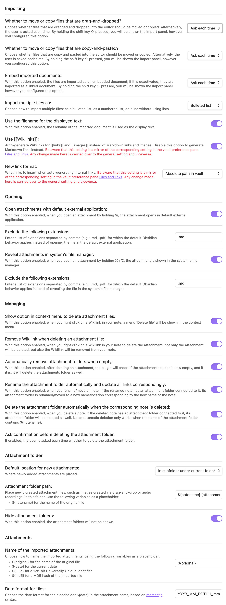

# Import Attachments+ for Obsidian

## Overview
**Import Attachments+** is a plugin designed to enhance the attachment management experience in Obsidian. It allows you to import, organize, and handle attachments (like images, documents, and other files) seamlessly within your vault. 

Features include:
- Moving or copying files into the vault upon import.
- Embedding or linking attachments.
- Configurable folder structures for attachments.
- Customizable naming conventions for imported files.
- Management tools for attachment folders.

## Installation
1. **Download the Plugin:**
   - Clone the plugin files from the [GitHub repository](https://github.com/alberti42/obsidian-import-attachments-plus).

2. **Install Dependencies:**
   - Run `npm install` to install the required dependencies.

3. **Build the Plugin:**
   - Run `npm run build` to compile the plugin code.
   - The compiled code will be placed in the `dist/PLATFORM_NAME` subfolder, where `PLATFORM_NAME` is based on your platform and architecture:
     - `dist/apple-silicon` (Apple Silicon Mac)
     - `dist/apple-intel` (Intel Mac)
     - `dist/windows` (Windows)
     - `dist/linux` (Linux)

4. **Copy to Obsidian Plugins Directory:**
   - Copy the contents of the relevant platform folder (e.g., `dist/windows`) into your vault's `.obsidian/plugins/import-attachments-plus` directory.

5. **Enable the Plugin:**
   - Open Obsidian and go to **Settings > Community Plugins**.
   - Enable **Import Attachments+**.

## Usage
Once enabled, the plugin will work automatically based on your configured preferences. You can adjust these settings through the plugin's settings tab under **Settings > Import Attachments+**.

## Settings
The plugin offers a comprehensive set of options for managing attachments.

### Key Settings

1. **Import Options:**
   - Move or copy files on drag-and-drop or copy-and-paste.
   - Embed or link imported attachments.
   - Import multiple files as a list or inline.

2. **Attachment Folder Configuration:**
   - Set the default location for new attachments.
   - Define folder paths relative to the note's location.
   - Customize attachment file names and date formats.

3. **Attachment Opening:**
   - Open attachments with the default external application or reveal them in the system's file manager.

4. **Attachment Management:**
   - Rename and delete attachment folders automatically.
   - Confirm before deleting attachment folders.

5. **Display of Attachment Folders:**
   - Toggle the visibility of attachment folders in the file explorer.

### Screenshot

Below is a screenshot of the settings tab:

    

## Donations
I would be grateful for any donation to support the development of this plugin.

## Author
- **Author:** Andrea Alberti
- **GitHub Profile:** [alberti42](https://github.com/alberti42)
- **Donations:** 

Feel free to contribute to the development of this plugin or report any issues in the [GitHub repository](https://github.com/alberti42/import-attachments-plus/issues).
