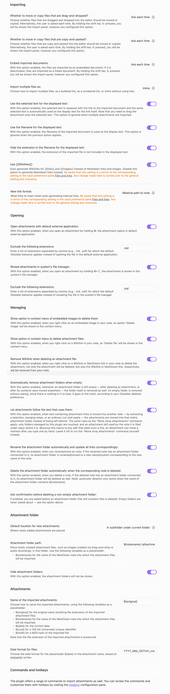

# Import Attachments+ for Obsidian

## Overview
**Import Attachments+** is a plugin designed to enhance the attachment management experience in Obsidian. It allows you to import, organize, and handle attachments (like images, documents, and other files) seamlessly within your vault. 

Features include:
- Moving or copying files into the vault upon import.
- Embedding or linking attachments.
- Configurable folder structures for attachments.
- Customizable naming conventions for imported files.
- Management tools for attachment folders.
- Keeping attachments with the notes that use them when text is moved between notes.

## Usage
Once enabled, the plugin will work automatically based on your configured preferences. You can adjust these settings through the plugin's settings tab under **Settings > Import Attachments+**.

### Keeping attachments with their notes

When you split a note — by extracting a selection, merging notes, or simply cutting and pasting text — the
attachments referenced by that text stay behind in the original note's attachment folder. The plugin moves
them into the attachment folder of the note that now uses them, updating all links.

An attachment is only moved when the note it is currently filed under no longer references it; one that is
still in use stays where it is, as does anything outside the attachment folders this plugin manages. This is
controlled by the setting *"Let attachments follow the text that uses them"*, which is enabled by default.

To tidy up a vault after the fact, or with that setting disabled, run the command
**Move stray attachments to their note's folder**. It lists every attachment that is filed under one note but
used by another, with a preview and a per-file confirmation, before moving anything.

### Commands

| Command | Description |
| --- | --- |
| Move file to vault as linked attachment | Pick a file and move it into the vault, inserting a link. |
| Move file to vault as embedded attachment | As above, inserting an embed. |
| Copy file to vault as linked attachment | Pick a file and copy it into the vault, inserting a link. |
| Copy file to vault as embedded attachment | As above, inserting an embed. |
| Open attachments folder | Open the current note's attachment folder in the system file manager. |
| Move stray attachments to their note's folder | Review and relocate attachments that are filed under a note which no longer uses them. |

### Settings
The plugin offers a comprehensive set of options for managing attachments.

<div align="left">
    
</div>

#### Key settings

1. **Import Options:**
   - Move or copy files on drag-and-drop or copy-and-paste.
   - Embed or link imported attachments.
   - Import multiple files as a list or inline.

2. **Attachment Folder Configuration:**
   - Set the default location for new attachments.
   - Define folder paths relative to the note's location.
   - Customize attachment file names and date formats.

3. **Attachment Opening:**
   - Open attachments with the default external application or reveal them in the system's file manager.

4. **Attachment Management:**
   - Rename and delete attachment folders automatically.
   - Remove attachment folders once they are left empty.
   - Confirm before deleting an attachment folder that still contains files.
   - Let attachments follow the text that uses them when it is moved to another note.

5. **Display of Attachment Folders:**
   - Toggle the visibility of attachment folders in the file explorer.

## Recommended installation

Search for "Import Attachments+" in the Community plugins pane in Obsidian and click on the Install button. 

### Manual Installation

#### Option 1: Download Pre-Built Files

1. Download the latest release from the [GitHub releases page](https://github.com/alberti42/obsidian-import-attachments-plus/releases).
2. In the release, you'll find the `main.js`, `manifest.json` and `styles.css` files.
3. Copy these three files to a new folder in your vault's `.obsidian/plugins/` directory (e.g., `.obsidian/plugins/import-attachments-plus`).
4. Enable the plugin `Import Attachments+` in Obsidian via `Settings` > `Community Plugins`.

#### Option 2: Build from Source

1. Clone this repository or download the source code from the [GitHub repository](https://github.com/alberti42/obsidian-import-attachments-plus).
2. Run the following commands to install the necessary dependencies and build the plugin. The build process will generate the `main.js` and `manifest.json` files inside the `/dist` subfolder within the repository directory:

	```bash
   npm install
   npm run build
	```
 
## Donations
I would be grateful for any donation to support the development of this plugin.

[](https://buymeacoffee.com/alberti)

## Author
- **Author:** Andrea Alberti
- **GitHub Profile:** [alberti42](https://github.com/alberti42)
- **Donations:** [](https://buymeacoffee.com/alberti)

Feel free to contribute to the development of this plugin or report any issues in the [GitHub repository](https://github.com/alberti42/import-attachments-plus/issues).
